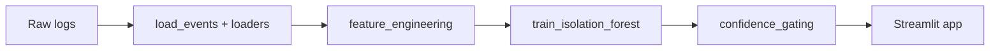

# Breach Precursor Detector

Early behavioral precursors to credential dumping and process injection often evade signature-based detection. This project uses unsupervised anomaly detection (Isolation Forest) on interpretable process features, confidence gating, and human-readable explanations to surface high-signal events—inspired by CrowdStrike-style EDR telemetry and the need for actionable, low-false-positive alerts in SOC workflows.

---

## 🎯 Problem & Motivation

Signature-based detection and static indicators struggle to catch novel attack techniques and living-off-the-land binaries (LOLBAS). Behavioral anomaly detection on process creation and access events fills that gap by looking at *how* processes relate (parent–child chains, command-line patterns, timing) rather than only *what* is running.

This project focuses on early precursors to credential dumping and process injection: unusual parent–child process pairs, high command-line entropy, LOLBAS usage, and known dump-related keywords (lsass, procdump, mimikatz, ntdsutil, vssadmin). Catching these behaviors before full exploitation supports breach prevention and triage.

Interpretability and human oversight are built in. Confidence gating ensures we flag only when both the anomaly score and domain heuristics agree, and every flagged event gets a short, SOC-friendly explanation. That design reduces alert fatigue and keeps the analyst in the loop—practical design for real-world security operations.

---

## 🛠️ Tech Stack


---

## 📊 Data Sources & Attribution

This project uses curated attack simulation logs from the [Splunk Attack Data repository](https://github.com/splunk/attack_data) (Apache License 2.0).  

Specific datasets used (from `datasets/attack_techniques/T1003.003/atomic_red_team/`):  
- `crowdstrike_falcon.log`: CrowdStrike Falcon sensor events (process rollups, parents, commands from credential dumping simulation).  
- `windows-sysmon.log`: Sysmon Events 1/8/10 (process creation, remote thread/injection, process access).  
- `4688_windows-security.log`: Windows Security Event 4688 (process creation).  

**License Compliance**  
© Splunk Inc. (Apache 2.0). No affiliation with Splunk or CrowdStrike.  

To reproduce the exact raw files:  
1. Visit https://github.com/splunk/attack_data/tree/master/datasets/attack_techniques/T1003.003/atomic_red_team  
2. Manually download the three `.log` files listed above (GitHub "Raw" → Save As).  
Full original license: [Apache 2.0](https://www.apache.org/licenses/LICENSE-2.0).

---

## 🏗️ Architecture & Design Choices

**Pipeline flow:** Raw logs (CrowdStrike Falcon NDJSON, Windows Security 4688 and Sysmon XML) are loaded and parsed ([load_events.py](load_events.py), [loaders/](loaders/)) into a unified schema (timestamp, process_image, parent_image, command_line, pid, ppid, etc.). Events are prepped and passed through feature engineering ([feature_engineering.py](feature_engineering.py)), which produces 12 interpretable features (e.g. suspicious parent, unusual parent–child chain score, command-line entropy, dump-precursor keywords, hidden/encoding flags, LOLBAS ratio, process-tree depth, Sysmon access patterns). An **Isolation Forest** is trained on the feature matrix ([train_isolation_forest.py](train_isolation_forest.py)); each event is scored and trace columns are merged. Confidence gating ([confidence_gating.py](confidence_gating.py)) assigns risk levels from score percentiles, defines a *strong indicator* (suspicious parent, dump precursor, or multiple hidden flags), and sets **flagged** only when the score is below threshold *and* strong indicator is true. Human-readable explanations are generated for every flagged row. The **Streamlit** dashboard ([app.py](app.py)) lets users upload or load sample scored data, filter by risk and keyword, sort, and download results.



**Key design decisions:**

- **Unsupervised learning** — Isolation Forest fits real-world settings where labeled attack data is scarce; we use heuristic labels only for evaluation and feature analysis.
- **Interpretable features** — All 12 features are explainable (parent–child rules, entropy, keywords, LOLBAS, etc.), so analysts can understand why an event was scored or flagged.
- **Confidence gating** — Flag only when anomaly score is below threshold *and* at least one strong indicator (suspicious parent, dump precursor, or ≥2 hidden flags) is present, to reduce false positives.
- **Reproducibility** — Pipeline outputs parquet artifacts and a threshold config (JSON) so runs are auditable and tunable.

---

## 🚀 Demo

**Demo video**  
*Coming Soon*

**Live app:** [https://breach-precursor-detector.streamlit.app/](https://breach-precursor-detector.streamlit.app/)
(Desktop browser recommended)

**Important note:** The app currently looks best in **Light mode**. If the text is hard to read in dark mode, please switch your browser/system theme to light (or use Streamlit's theme selector in the top-right menu if available). This is a known rendering quirk we're working on improving.

**Run locally**  
From the project root: `streamlit run app.py`. If `output/scored_events_gated.parquet` exists, use **Load sample data** in the sidebar to load it without re-running the pipeline.

**Screenshot** 


---

## Quick Start

```bash
git clone https://github.com/rvong65/breach-precursor-detector.git
cd breach-precursor-detector
pip install -r requirements.txt
```

If `output/scored_events_gated.parquet` already exists (e.g. from a previous pipeline run), start the app and click **Load sample data** in the sidebar:

```bash
streamlit run app.py
```

Otherwise, run the pipeline in order to generate artifacts:

```bash
python load_events.py --data-dir data
python feature_engineering.py --data-dir data --output-dir output
python train_isolation_forest.py --x-path output/X_features.parquet --output-dir output
python confidence_gating.py --scored-path output/scored_events.parquet --x-path output/X_features.parquet --output-dir output
streamlit run app.py
```

Then use **Load sample data** to load `output/scored_events_gated.parquet`.

---

## Safety Considerations

Confidence gating and human-readable explanations are designed to reduce alert fatigue and enable analyst oversight. The system is intended to *support*, not replace, human judgment in security operations. Flagged events are suggestions for triage; final decisions and actions remain with the operator.

---

## 📈 Project Status & Build Log

| Step | Focus |
|------|--------|
| 1 | **Data** — Load and unify CrowdStrike Falcon, 4688, and Sysmon logs into a single schema. |
| 2 | **Features** — Prep events, build 12 interpretable features, heuristic labels, EDA, RF importance. |
| 3 | **Model** — Train Isolation Forest (unsupervised), score events, merge trace columns, save scored parquet. |
| 4 | **Gating** — Risk levels, strong-indicator logic, flagged flag, explanations, threshold config. |
| 5 | **UI** — Streamlit dashboard: upload/sample load, filters, sort, table, full command line, CSV download. |

---

## 📄 License

This codebase is offered under the **MIT License**. Dataset attribution and license (Splunk Attack Data, Apache 2.0) are described in the Data Sources section above. No affiliation with Splunk or CrowdStrike.

---

## 🤝 Contact / Next Steps

Open to feedback, suggestions, and mission-aligned collaboration.

**Potential future directions** (no promises on timeline):
- Ensemble methods (Isolation Forest + autoencoder or local outlier factor) for better precursor coverage
- Real-time ingestion from live EDR feeds (e.g., via Kafka or file watcher)
- Integration of lightweight LLM-based summarization for flagged events
- Applying the same pipeline to additional MITRE ATT&CK techniques (process injection T1055, elevation of privilege T1548, etc.)


