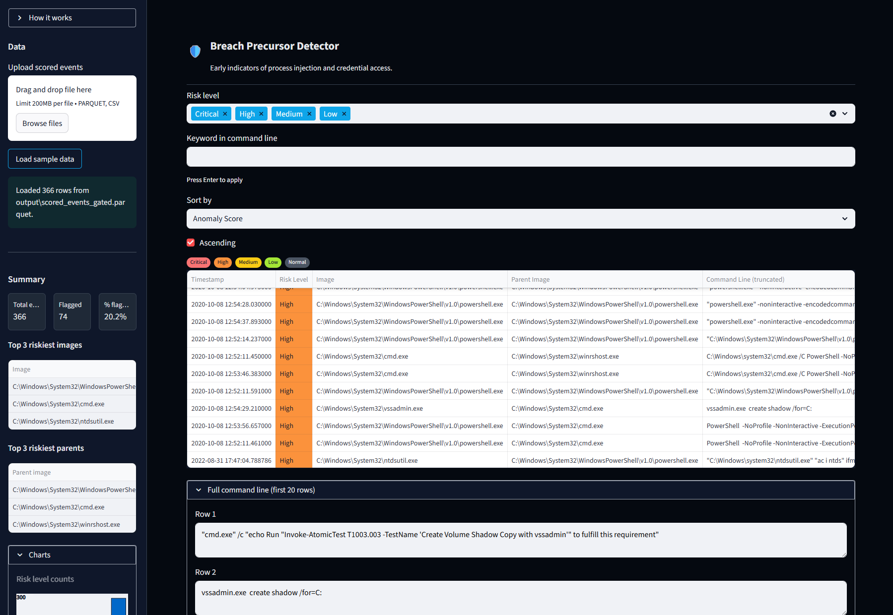
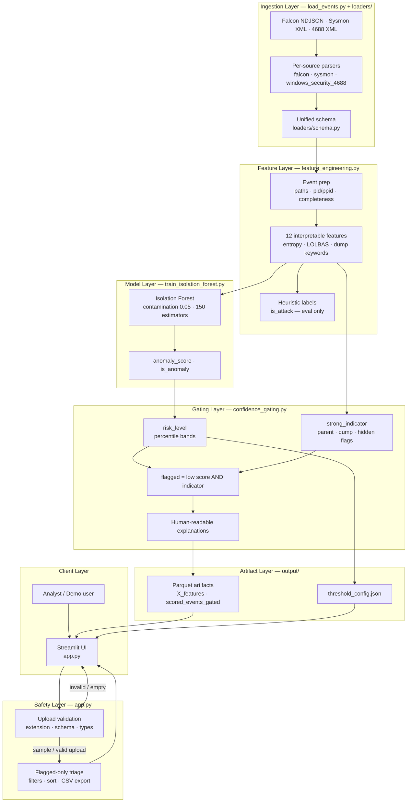

# Breach Precursor Detector

Early behavioral precursors to credential dumping and process injection often evade signature-based detection. This project uses unsupervised anomaly detection (Isolation Forest) on interpretable process features, confidence gating, and human-readable explanations to surface high-signal events—inspired by CrowdStrike-style EDR telemetry and the need for actionable, low-false-positive alerts in SOC workflows.

---

## Table of Contents

**Get started**
- [Live Demo](#live-demo)
- [Features](#features)
- [Quick Start](#quick-start)

**Overview**
- [Problem & Motivation](#problem-motivation)
- [Tech Stack](#tech-stack)
- [Data Sources & Attribution](#data-sources)

**Technical**
- [Architecture & Design Choices](#architecture-design-choices)
  - [Development Journey](#development-journey)
- [Safety Considerations](#safety-considerations)
- [CI/CD](#cicd)
- [Project Status & Build Log](#project-status)
- [Repository Layout](#repository-layout)

**Legal & contact**
- [License](#license)
- [Contact / Next Steps](#contact)

---

<a id="live-demo"></a>

## 🚀 Live Demo

**[▶ Open the live app on Streamlit Cloud](https://breach-precursor-detector.streamlit.app/)** (Desktop browser recommended)

**Before you open the app:**
- **Cold start:** This app runs on Streamlit Community Cloud and may go to sleep after inactivity. If you see **“Zzzz — This app has gone to sleep due to inactivity”**, click **“Yes, get this app back up!”** to wake it — anyone can do this; you don’t need to contact the maintainer. Startup may take a minute after you click.
- **Display:** The app looks best in **light mode**. If text is hard to read in dark mode, switch your browser/system theme or use Streamlit’s theme selector in the top-right menu. This is a known rendering quirk we're working on improving.

**Run locally:**  
From the project root: `streamlit run app.py`. If `output/scored_events_gated.parquet` exists, use **Load sample data** in the sidebar to load it without re-running the pipeline.

**Screenshot:**



---

<a id="features"></a>

## ✨ Features

- **Unsupervised Isolation Forest** — anomaly scoring on 12 interpretable process features without requiring labeled attack data for training
- **Multi-source log ingestion** — Falcon NDJSON, Sysmon XML, and Windows 4688 parsed into one unified schema via [loaders/](loaders/)
- **Confidence gating** — flags events only when a low anomaly score *and* a strong domain indicator (suspicious parent, dump precursor, or ≥2 hidden flags) align
- **Human-readable explanations** — rule-based, SOC-friendly reason strings for every flagged event
- **Risk level bands** — Critical / High / Medium / Low / Normal from anomaly-score percentiles
- **Cybersecurity UI** — dark SOC theme, risk badges, How It Works sidebar, and sidebar summary charts
- **Analyst triage** — flagged-only main table with risk-level and keyword filters, sortable columns, and full command-line expander
- **CSV export** — download filtered flagged events; threshold config available when present in `output/`
- **Upload validation** — `.csv` / `.parquet` extension checks, required-column validation, and friendly error messages (no raw tracebacks)
- **Sample data workflow** — one-click load of pre-scored gated parquet for demos without re-running the pipeline

---

<a id="quick-start"></a>

## ⚡ Quick Start

```bash
git clone https://github.com/rvong65/breach-precursor-detector.git
cd breach-precursor-detector
pip install -r requirements.txt
```

If `output/scored_events_gated.parquet` already exists (e.g. from a previous pipeline run), start the app and click **Load sample data** in the sidebar:

```bash
streamlit run app.py
```

Otherwise, run the pipeline in order to generate artifacts:

```bash
python load_events.py --data-dir data
python feature_engineering.py --data-dir data --output-dir output
python train_isolation_forest.py --x-path output/X_features.parquet --output-dir output
python confidence_gating.py --scored-path output/scored_events.parquet --x-path output/X_features.parquet --output-dir output
streamlit run app.py
```

Then use **Load sample data** to load `output/scored_events_gated.parquet`.

**Run tests locally**

```bash
pip install -r requirements-dev.txt
pytest tests/ -q
```

---

<a id="problem-motivation"></a>

## 🎯 Problem & Motivation

Signature-based detection and static indicators struggle to catch novel attack techniques and living-off-the-land binaries (LOLBAS). Behavioral anomaly detection on process creation and access events fills that gap by looking at *how* processes relate (parent–child chains, command-line patterns, timing) rather than only *what* is running.

This project focuses on early precursors to credential dumping and process injection: unusual parent–child process pairs, high command-line entropy, LOLBAS usage, and known dump-related keywords (lsass, procdump, mimikatz, ntdsutil, vssadmin). Catching these behaviors before full exploitation supports breach prevention and triage.

Interpretability and human oversight are built in. Confidence gating ensures we flag only when both the anomaly score and domain heuristics agree, and every flagged event gets a short, SOC-friendly explanation. That design reduces alert fatigue and keeps the analyst in the loop—practical design for real-world security operations.

---

<a id="tech-stack"></a>

## 🛠️ Tech Stack


---

<a id="data-sources"></a>

## 📊 Data Sources & Attribution

This project uses curated attack simulation logs from the [Splunk Attack Data repository](https://github.com/splunk/attack_data) (Apache License 2.0).

**Datasets used** (from `datasets/attack_techniques/T1003.003/atomic_red_team/`):

| File | Description |
|------|-------------|
| `crowdstrike_falcon.log` | CrowdStrike Falcon sensor events (process rollups, parents, commands from credential dumping simulation) |
| `windows-sysmon.log` | Sysmon Events 1/8/10 (process creation, remote thread/injection, process access) |
| `4688_windows-security.log` | Windows Security Event 4688 (process creation) |

**License compliance**
- © Splunk Inc. (Apache 2.0). No affiliation with Splunk or CrowdStrike.
- Data used solely for **educational and research purposes**.
- Full license: [Apache 2.0](https://www.apache.org/licenses/LICENSE-2.0).

**Reproduce the raw files**
1. Visit [T1003.003 atomic_red_team](https://github.com/splunk/attack_data/tree/master/datasets/attack_techniques/T1003.003/atomic_red_team).
2. Download the three `.log` files listed above (GitHub **Raw** → Save As).
3. Place them in the local `data/` directory (gitignored).

---

<a id="architecture-design-choices"></a>

## 🏗️ Architecture & Design Choices



**Pipeline summary:** Raw logs (CrowdStrike Falcon NDJSON, Windows Security 4688 and Sysmon XML) are loaded and parsed ([load_events.py](load_events.py), [loaders/](loaders/)) into a unified schema (timestamp, process_image, parent_image, command_line, pid, ppid, etc.). Events are prepped and passed through feature engineering ([feature_engineering.py](feature_engineering.py)), which produces 12 interpretable features (e.g. suspicious parent, unusual parent–child chain score, command-line entropy, dump-precursor keywords, hidden/encoding flags, LOLBAS ratio, process-tree depth, Sysmon access patterns). An **Isolation Forest** is trained on the feature matrix ([train_isolation_forest.py](train_isolation_forest.py)); each event is scored and trace columns are merged. Confidence gating ([confidence_gating.py](confidence_gating.py)) assigns risk levels from score percentiles, defines a *strong indicator* (suspicious parent, dump precursor, or multiple hidden flags), and sets **flagged** only when the score is below threshold *and* strong indicator is true. Human-readable explanations are generated for every flagged row. The **Streamlit** dashboard ([app.py](app.py)) lets users upload or load sample scored data, filter by risk and keyword, sort, and download results.

**Key design decisions**

| Decision | Rationale |
|----------|-----------|
| Unsupervised learning | Isolation Forest fits settings where labeled attack data is scarce; heuristic labels are used only for evaluation and feature analysis |
| Interpretable features | All 12 features are explainable (parent–child rules, entropy, keywords, LOLBAS, etc.) so analysts understand why an event was scored or flagged |
| Confidence gating | Flag only when anomaly score is below threshold *and* at least one strong indicator is present — reduces false positives |
| Reproducibility | Pipeline outputs parquet artifacts and a threshold config (JSON) so runs are auditable and tunable |

<a id="development-journey"></a>

### Development Journey

```mermaid
flowchart LR
    A[Multi-source log ingest<br/>Falcon · Sysmon · 4688] --> B[Feature engineering<br/>12 interpretable features]
    B --> C[Isolation Forest<br/>unsupervised scoring]
    C --> D[Confidence gating<br/>risk + explanations]
    D --> E[Streamlit UI<br/>SOC theme + triage]
    E --> F[Upload validation<br/>schema + type checks]
    F --> G[Sample parquet workflow<br/>reproducible artifacts]
    G --> H[Streamlit Cloud deploy<br/>MVP]
    H --> I[GitHub Actions CI<br/>offline tests]
```



---

<a id="safety-considerations"></a>

## 🛡️ Safety Considerations

| Principle | Implementation |
|-----------|----------------|
| Read-only operations | No blocking, quarantine, endpoint response, or exploitation tooling — triage and export only |
| Human-in-the-loop | Flagged events are suggestions for investigation; final decisions remain with the analyst |
| Confidence gating | `add_flagged()` in [confidence_gating.py](confidence_gating.py) requires both low anomaly score and `strong_indicator()` — reduces false-positive alert fatigue |
| Explainability | 12 interpretable features plus template-based explanations — not a black-box-only alert |
| Upload validation | Extension whitelist (`.csv`, `.parquet`); required columns; timestamp/pid/ppid type checks; `st.stop()` on invalid input in [app.py](app.py) |
| Simulation data only | Public demo uses Splunk Attack Data (T1003.003 simulation) — not live production EDR feeds |
| Educational use | Attack simulation data used solely for educational and research purposes (see [Data Sources](#data-sources)) |
| No secrets in UI | No API keys or credentials required for the current MVP; pipeline and app run from local/Cloud env only |
| Vendor disclaimer | No affiliation with Splunk, CrowdStrike, or commercial EDR vendors |
| Analyst disclaimer | UI How It Works + README: correlate findings with internal telemetry and context before taking action |

---

<a id="cicd"></a>

## 🔄 CI/CD

GitHub Actions runs on every push and pull request to `main` / `master`:

| | |
|--|--|
| **Workflow** | `.github/workflows/tests.yml` |
| **Scope** | 81 offline unit tests (feature engineering, confidence gating, schema normalizers, Falcon NDJSON parsing, Isolation Forest helpers, upload validation, pipeline smoke) |
| **API keys** | **None** — CI does not call external APIs or require EDR credentials |
| **Python** | 3.11 and 3.12 on `ubuntu-latest` |

This is a **CI pipeline** for regression safety; **CD** (continuous deployment) is handled by Streamlit Cloud on merge to the default branch.

---

<a id="project-status"></a>

## 📈 Project Status & Build Log

| Step | Focus | Status |
|------|-------|--------|
| 1 | Multi-source log ingest (Falcon, Sysmon, 4688) | ✅ |
| 2 | Feature engineering — 12 features + heuristic labels | ✅ |
| 3 | Isolation Forest training + scoring | ✅ |
| 4 | Confidence gating + explanations + threshold config | ✅ |
| 5 | Streamlit UI + custom SOC theme | ✅ |
| 6 | Upload validation + friendly error UX | ✅ |
| 7 | Sample parquet workflow + reproducible artifacts | ✅ |
| 8 | Streamlit Cloud deploy | ✅ |
| 9 | Offline tests + GitHub Actions CI | ✅ |

**Current status:** ✅ MVP complete — live on Streamlit Cloud with GitHub Actions CI.

---

<a id="repository-layout"></a>

## 📁 Repository Layout

```
├── app.py                      # Streamlit UI — upload, filters, triage, export
├── load_events.py              # CLI: combine multi-source logs into unified events
├── feature_engineering.py      # Prep, 12 features, heuristic labels, EDA, RF importance
├── train_isolation_forest.py   # Train Isolation Forest, score events, evaluation plots
├── confidence_gating.py        # Risk levels, gating, explanations, threshold JSON
├── loaders/                    # Per-format parsers + unified schema
│   ├── falcon.py               # CrowdStrike Falcon NDJSON
│   ├── sysmon.py               # Sysmon XML (events 1/8/10)
│   ├── windows_security_4688.py
│   └── schema.py               # Unified column mapping
├── output/                     # Pipeline artifacts (parquet, threshold_config.json)
├── data/                       # Raw attack simulation logs (gitignored; download separately)
├── docs/screenshots/           # README demo images
├── tests/                      # Offline unit + integration tests
├── .github/workflows/tests.yml # GitHub Actions CI
├── requirements.txt            # Python dependencies
├── requirements-dev.txt        # Dev deps (pytest) for CI and local testing
├── pytest.ini                  # Pytest configuration
├── LICENSE                     # MIT License
└── README.md                   # Project overview (this file)
```

---

<a id="license"></a>

## 📄 License

**MIT License** — see [LICENSE](LICENSE).

Dataset attribution and license (Splunk Attack Data, Apache 2.0) are described in [Data Sources & Attribution](#data-sources). Data used solely for **educational and research purposes**. No affiliation with Splunk or CrowdStrike.

---

<a id="contact"></a>

## 🤝 Contact / Next Steps

Open to feedback, suggestions, and mission-aligned collaboration.

**Potential future directions** (no promises on timeline):
- Ensemble methods (Isolation Forest + autoencoder or local outlier factor) for better precursor coverage
- Real-time ingestion from live EDR feeds (e.g., via Kafka or file watcher)
- Integration of lightweight LLM-based summarization for flagged events
- Applying the same pipeline to additional MITRE ATT&CK techniques (process injection T1055, elevation of privilege T1548, etc.)
