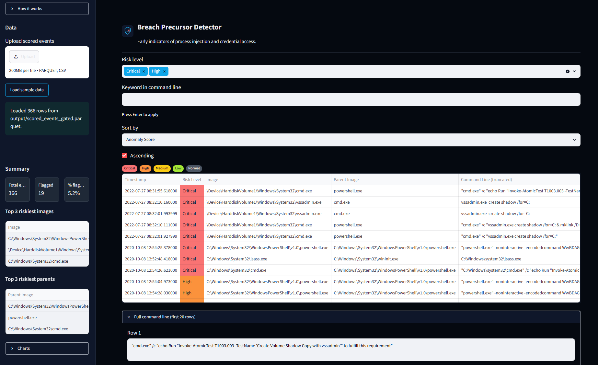
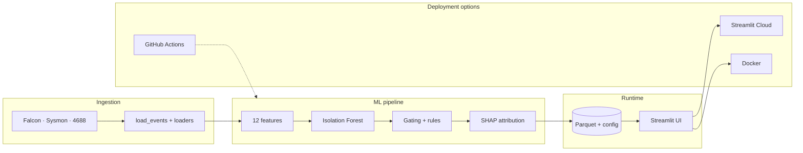
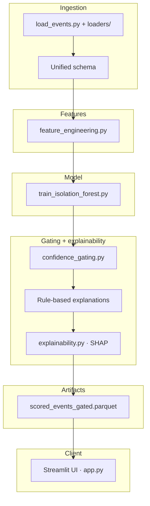
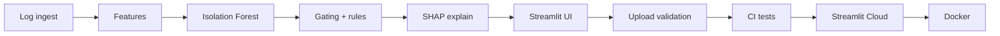

<h1 align="center">
  
  
</h1>

[](https://github.com/rvong65/breach-precursor-detector/releases)
[](https://github.com/rvong65/breach-precursor-detector/actions/workflows/tests.yml)
[](LICENSE)
[](https://breach-precursor-detector.streamlit.app/)

Early behavioral precursors to credential dumping and process injection often evade signature-based detection. This project uses unsupervised anomaly detection (Isolation Forest) on interpretable process features, confidence gating, rule-based and SHAP-augmented explanations to surface high-signal events—inspired by CrowdStrike-style EDR telemetry and the need for actionable, low-false-positive alerts in SOC workflows.

---

<details open>
<summary><strong>Table of Contents</strong></summary>

| Section | Description |
|---------|-------------|
| **Get started** | |
| 🚀 [Live Demo](#live-demo) | Try the Streamlit app (Cloud or local) |
| ✨ [Features](#features) | Capabilities at a glance |
| ⚡ [Quick Start](#quick-start) | Clone, install, run, test, Docker |
| **Overview** | |
| 🎯 [Problem & Motivation](#problem-motivation) | Why behavioral precursors matter |
| 🛠️ [Tech Stack](#tech-stack) | Languages, libraries, CI |
| 📊 [Data Sources & Attribution](#data-sources) | Splunk Attack Data (T1003.003) |
| 📌 [Version history](#version-history) | Release highlights |
| **Technical** | |
| 🏗️ [Architecture & Design Choices](#architecture-design-choices) | System design and pipeline |
| ↳ [Full architecture doc](docs/architecture.md) | Detailed system design (Mermaid) |
| ↳ [Development Journey](#development-journey) | Build timeline diagram |
| 🛡️ [Safety Considerations](#safety-considerations) | Ethics and guardrails |
| 🔄 [CI/CD](#cicd) | GitHub Actions and deployment |
| 📈 [Project Status & Build Log](#project-status) | Milestone checklist |
| 📁 [Repository Layout](#repository-layout) | File tree |
| **Legal & contact** | |
| 📄 [License](#license) | MIT + dataset attribution |
| 🤝 [Contact / Next Steps](#contact) | Feedback and V2 roadmap |

</details>

---

<a id="live-demo"></a>

## 🚀 Live Demo

**[▶ Open the live app on Streamlit Cloud](https://breach-precursor-detector.streamlit.app/)** (Desktop browser recommended)

**Before you open the app:**
- **Cold start:** This app runs on Streamlit Community Cloud and may go to sleep after inactivity. If you see **“Zzzz — This app has gone to sleep due to inactivity”**, click **“Yes, get this app back up!”** to wake it — anyone can do this; you don’t need to contact the maintainer. Startup may take a minute after you click.
- **Display:** The app looks best in **light mode**. If text is hard to read in dark mode, switch your browser/system theme or use Streamlit’s theme selector in the top-right menu. This is a known rendering quirk we're working on improving.

**Run locally:**  
From the project root: `streamlit run app.py`. If `output/scored_events_gated.parquet` exists, use **Load sample data** in the sidebar to load it without re-running the pipeline.

**Understanding alerts vs risk bands:** Every event gets a **risk level** (Critical / High / Medium / Low / Normal) from anomaly-score percentiles. The main table shows **confidence-gated alerts** only — rows where `flagged == true` (low score *and* a strong domain indicator). On sample data that is **19 alerts** (Critical + High), not all 74 non-Normal events. Medium and Low band events appear in sidebar charts but are intentionally excluded from the alert table to reduce noise.

**Screenshot:**



---

<a id="features"></a>

## ✨ Features

- **Unsupervised Isolation Forest** — anomaly scoring on 12 interpretable process features without requiring labeled attack data for training
- **Multi-source log ingestion** — Falcon NDJSON, Sysmon XML, and Windows 4688 parsed into one unified schema via [loaders/](loaders/)
- **Confidence gating** — flags events only when a low anomaly score *and* a strong domain indicator (suspicious parent, dump precursor, or ≥2 hidden flags) align; the app table shows gated alerts, not every non-Normal risk band
- **Human-readable explanations** — hybrid: rule-based SOC strings plus SHAP top-feature attribution on flagged events
- **Docker support** — reproducible local runs via `docker compose up --build` (sample data included)
- **Risk level bands** — Critical / High / Medium / Low / Normal from anomaly-score percentiles
- **Cybersecurity UI** — dark SOC theme, risk badges, How It Works sidebar, and sidebar summary charts
- **Analyst triage** — confidence-gated alerts in the main table; risk-level and keyword filters, sortable columns, full command-line expander
- **CSV export** — download filtered flagged events; threshold config available when present in `output/`
- **Upload validation** — `.csv` / `.parquet` extension checks, required-column validation, and friendly error messages (no raw tracebacks)
- **Sample data workflow** — one-click load of pre-scored gated parquet for demos without re-running the pipeline

---

<a id="quick-start"></a>

## ⚡ Quick Start

```bash
git clone https://github.com/rvong65/breach-precursor-detector.git
cd breach-precursor-detector
pip install -r requirements.txt
```

If `output/scored_events_gated.parquet` already exists (e.g. from a previous pipeline run), start the app and click **Load sample data** in the sidebar:

```bash
streamlit run app.py
```

Otherwise, run the pipeline in order to generate artifacts:

```bash
python load_events.py --data-dir data
python feature_engineering.py --data-dir data --output-dir output
python train_isolation_forest.py --x-path output/X_features.parquet --output-dir output
python confidence_gating.py --scored-path output/scored_events.parquet --x-path output/X_features.parquet --output-dir output
streamlit run app.py
```

SHAP attribution runs during gating when `output/isolation_forest_model.pkl` exists (produced by the train step above). Use `--no-shap` to skip.

Then use **Load sample data** to load `output/scored_events_gated.parquet` (366 events; **19** confidence-gated alerts with SHAP-augmented explanations in v1.1 sample data).

**Run tests locally**

```bash
pip install -r requirements-dev.txt
pytest tests/ -q
```

**Run with Docker**

```bash
docker compose up --build
# open http://localhost:8501
```

The default image includes the pre-scored sample parquet. For the full pipeline, download raw logs into `data/` and run:

```bash
docker compose --profile pipeline run --rm pipeline
```

Use the [devcontainer](.devcontainer/devcontainer.json) for VS Code / Codespaces; use Docker for a standalone portable runtime.

---

<a id="problem-motivation"></a>

## 🎯 Problem & Motivation

Signature-based detection and static indicators struggle to catch novel attack techniques and living-off-the-land binaries (LOLBAS). Behavioral anomaly detection on process creation and access events fills that gap by looking at *how* processes relate (parent–child chains, command-line patterns, timing) rather than only *what* is running.

This project focuses on early precursors to credential dumping and process injection: unusual parent–child process pairs, high command-line entropy, LOLBAS usage, and known dump-related keywords (lsass, procdump, mimikatz, ntdsutil, vssadmin). Catching these behaviors before full exploitation supports breach prevention and triage.

Interpretability and human oversight are built in. Confidence gating ensures we flag only when both the anomaly score and domain heuristics agree, and every flagged event gets a short, SOC-friendly explanation. That design reduces alert fatigue and keeps the analyst in the loop—practical design for real-world security operations.

---

<a id="tech-stack"></a>

## 🛠️ Tech Stack


---

<a id="data-sources"></a>

## 📊 Data Sources & Attribution

This project uses curated attack simulation logs from the [Splunk Attack Data repository](https://github.com/splunk/attack_data) (Apache License 2.0).

**Datasets used** (from `datasets/attack_techniques/T1003.003/atomic_red_team/`):

| File | Description |
|------|-------------|
| `crowdstrike_falcon.log` | CrowdStrike Falcon sensor events (process rollups, parents, commands from credential dumping simulation) |
| `windows-sysmon.log` | Sysmon Events 1/8/10 (process creation, remote thread/injection, process access) |
| `4688_windows-security.log` | Windows Security Event 4688 (process creation) |

**License compliance**
- © Splunk Inc. (Apache 2.0). No affiliation with Splunk or CrowdStrike.
- Data used solely for **educational and research purposes**.
- Full license: [Apache 2.0](https://www.apache.org/licenses/LICENSE-2.0).

**Reproduce the raw files**
1. Visit [T1003.003 atomic_red_team](https://github.com/splunk/attack_data/tree/master/datasets/attack_techniques/T1003.003/atomic_red_team).
2. Download the three `.log` files listed above (GitHub **Raw** → Save As).
3. Place them in the local `data/` directory (gitignored).

---

<a id="version-history"></a>

## 📌 Version history

| Version | Highlights | Release |
|---------|------------|---------|
| **v1.1.0** | SHAP explainability, Docker support, CI Docker build (92 tests) | [Releases](https://github.com/rvong65/breach-precursor-detector/releases) · [CHANGELOG](CHANGELOG.md#110---2026-06-19) |
| **v1.0.0** | MVP — Isolation Forest pipeline, Streamlit app, CI (81 tests) | [Releases](https://github.com/rvong65/breach-precursor-detector/releases) · [CHANGELOG](CHANGELOG.md#100---2026-06-18) |

---

<a id="architecture-design-choices"></a>

## 🏗️ Architecture & Design Choices

High-level flow (ingest → model → gating + SHAP → UI; deploy via Cloud, Docker, or local):



<details>
<summary><strong>Detailed pipeline diagram</strong> (expand for full layer view)</summary>



</details>

For the full system design (data flow, 12 features, gating logic, deployment topologies), see **[docs/architecture.md](docs/architecture.md)**.

**Pipeline summary:** Raw logs (CrowdStrike Falcon NDJSON, Windows Security 4688 and Sysmon XML) are loaded and parsed ([load_events.py](load_events.py), [loaders/](loaders/)) into a unified schema. Feature engineering ([feature_engineering.py](feature_engineering.py)) produces 12 interpretable features. An **Isolation Forest** ([train_isolation_forest.py](train_isolation_forest.py)) scores each event. **Confidence gating** ([confidence_gating.py](confidence_gating.py)) assigns risk levels, flags high-signal rows, and builds rule-based explanations. **SHAP** ([explainability.py](explainability.py)) appends top contributing features for flagged events at batch time (when the saved model is present). Artifacts land in `output/`; the **Streamlit** dashboard ([app.py](app.py)) loads sample or uploaded data for triage. Run locally, via **Docker**, or on **Streamlit Cloud**; **GitHub Actions** validates tests and the Docker image on every push.

**Key design decisions**

| Decision | Rationale |
|----------|-----------|
| Unsupervised learning | Isolation Forest fits settings where labeled attack data is scarce; heuristic labels are used only for evaluation and feature analysis |
| Interpretable features | All 12 features are explainable (parent–child rules, entropy, keywords, LOLBAS, etc.) so analysts understand why an event was scored or flagged |
| Hybrid explainability | Rule-based SOC strings first; SHAP adds model-level top-feature attribution on flagged rows without replacing domain heuristics |
| Confidence gating | Flag only when anomaly score is below threshold *and* at least one strong indicator is present — reduces false positives |
| Batch-time SHAP | Explanations precomputed during gating (not in the Streamlit request path) — fast demos and no API keys |
| Reproducibility | Parquet artifacts, threshold config JSON, Dockerfile, and CI keep runs auditable across local, Docker, and Cloud |

<a id="development-journey"></a>

### Development Journey



---

<a id="safety-considerations"></a>

## 🛡️ Safety Considerations

| Principle | Implementation |
|-----------|----------------|
| Read-only operations | No blocking, quarantine, endpoint response, or exploitation tooling — triage and export only |
| Human-in-the-loop | Flagged events are suggestions for investigation; final decisions remain with the analyst |
| Confidence gating | `add_flagged()` in [confidence_gating.py](confidence_gating.py) requires both low anomaly score and `strong_indicator()` — reduces false-positive alert fatigue |
| Explainability | Rule-based explanations plus optional SHAP top-feature attribution on flagged rows — not black-box-only |
| Upload validation | Extension whitelist (`.csv`, `.parquet`); required columns; timestamp/pid/ppid type checks; `st.stop()` on invalid input in [app.py](app.py) |
| Simulation data only | Public demo uses Splunk Attack Data (T1003.003 simulation) — not live production EDR feeds |
| Educational use | Attack simulation data used solely for educational and research purposes (see [Data Sources](#data-sources)) |
| No secrets in UI | No API keys or credentials required for the current MVP; pipeline and app run from local/Cloud env only |
| Vendor disclaimer | No affiliation with Splunk, CrowdStrike, or commercial EDR vendors |
| Analyst disclaimer | UI How It Works + README: correlate findings with internal telemetry and context before taking action |

---

<a id="cicd"></a>

## 🔄 CI/CD

**GitHub Actions** runs on every push and pull request to `main` / `master`:

| Step | Action |
|------|--------|
| **Trigger** | Push or PR to `main` / `master` |
| **Environment** | `ubuntu-latest`, Python 3.11 and 3.12 (matrix) |
| **Install** | `pip install -r requirements-dev.txt` |
| **Test** | `pytest tests/ -q` (92 offline tests — features, gating, SHAP, schema, upload validation, pipeline smoke) |
| **Docker** | `docker build` verifies the `Dockerfile` on each push/PR |

Workflow file: [`.github/workflows/tests.yml`](.github/workflows/tests.yml)

All tests run offline with in-memory fixtures; no raw log files, `data/` directory, or API keys required in CI. **Streamlit Cloud** deploys independently from the `main` branch when connected to this repository (`app.py` + `requirements.txt`).

---

<a id="project-status"></a>

## 📈 Project Status & Build Log

| Step | Focus | Status |
|------|-------|--------|
| 1 | Multi-source log ingest (Falcon, Sysmon, 4688) | ✅ |
| 2 | Feature engineering — 12 features + heuristic labels | ✅ |
| 3 | Isolation Forest training + scoring | ✅ |
| 4 | Confidence gating + explanations + threshold config | ✅ |
| 5 | Streamlit UI + custom SOC theme | ✅ |
| 6 | Upload validation + friendly error UX | ✅ |
| 7 | Sample parquet workflow + reproducible artifacts | ✅ |
| 8 | Streamlit Cloud deploy | ✅ |
| 9 | Offline tests + GitHub Actions CI | ✅ |
| 10 | SHAP explainability + Docker + architecture docs | ✅ |

**Current status:** v1.1 — live on Streamlit Cloud with CI, Docker, and SHAP-augmented explanations.

---

<a id="repository-layout"></a>

## 📁 Repository Layout

```
├── app.py                      # Streamlit UI — upload, filters, triage, export
├── explainability.py           # SHAP TreeExplainer for flagged events
├── load_events.py              # CLI: combine multi-source logs into unified events
├── feature_engineering.py      # Prep, 12 features, heuristic labels, EDA, RF importance
├── train_isolation_forest.py   # Train Isolation Forest, score events, evaluation plots
├── confidence_gating.py        # Risk levels, gating, explanations, threshold JSON
├── Dockerfile                  # Portable Streamlit runtime
├── docker-compose.yml          # App + optional pipeline profile
├── loaders/                    # Per-format parsers + unified schema
│   ├── falcon.py               # CrowdStrike Falcon NDJSON
│   ├── sysmon.py               # Sysmon XML (events 1/8/10)
│   ├── windows_security_4688.py
│   └── schema.py               # Unified column mapping
├── output/                     # Committed: gated parquet, threshold config, saved model (see .gitignore)
├── data/                       # Raw attack simulation logs (gitignored; download separately)
├── assets/
│   ├── icon.svg                # App header icon (dark SOC theme)
│   ├── logo.svg                # README wordmark (GitHub light mode)
│   ├── logo-dark.svg           # README wordmark (GitHub dark mode)
│   └── favicon.png             # Browser tab icon (Streamlit page_icon)
├── docs/
│   ├── architecture.md         # Full system design (detailed Mermaid diagrams)
│   └── screenshots/            # README demo images
├── tests/                      # Offline unit + integration tests
├── .github/workflows/tests.yml # GitHub Actions CI (+ Docker build)
├── .devcontainer/              # VS Code / Codespaces dev environment
├── requirements.txt            # Python dependencies
├── requirements-dev.txt        # Dev deps (pytest) for CI and local testing
├── pytest.ini                  # Pytest configuration
├── CHANGELOG.md                # Version-by-version change history
├── LICENSE                     # MIT License
└── README.md                   # Project overview (this file)
```

---

<a id="license"></a>

## 📄 License

**MIT License** — see [LICENSE](LICENSE).

Dataset attribution and license (Splunk Attack Data, Apache 2.0) are described in [Data Sources & Attribution](#data-sources). Data used solely for **educational and research purposes**. No affiliation with Splunk or CrowdStrike.

---

<a id="contact"></a>

## 🤝 Contact / Next Steps

Open to feedback, suggestions, and mission-aligned collaboration.

### V2 roadmap (planned)

| Area | Direction | 
|------|-----------|
| GenAI | Optional LLM summaries (Groq/Ollama) for flagged events | 
| Features | Sentence-transformer embeddings on command lines | 
| Models | Autoencoder / LOF ensemble with Isolation Forest | 
| Orchestration | SHAP evidence → LLM analyst brief | 
| MLOps | MLflow registry, held-out time-window eval | 
| Ingestion | Real-time Kafka / file-watcher from live EDR | 
| MITRE | Additional techniques (T1055 injection, T1548 priv esc) |
