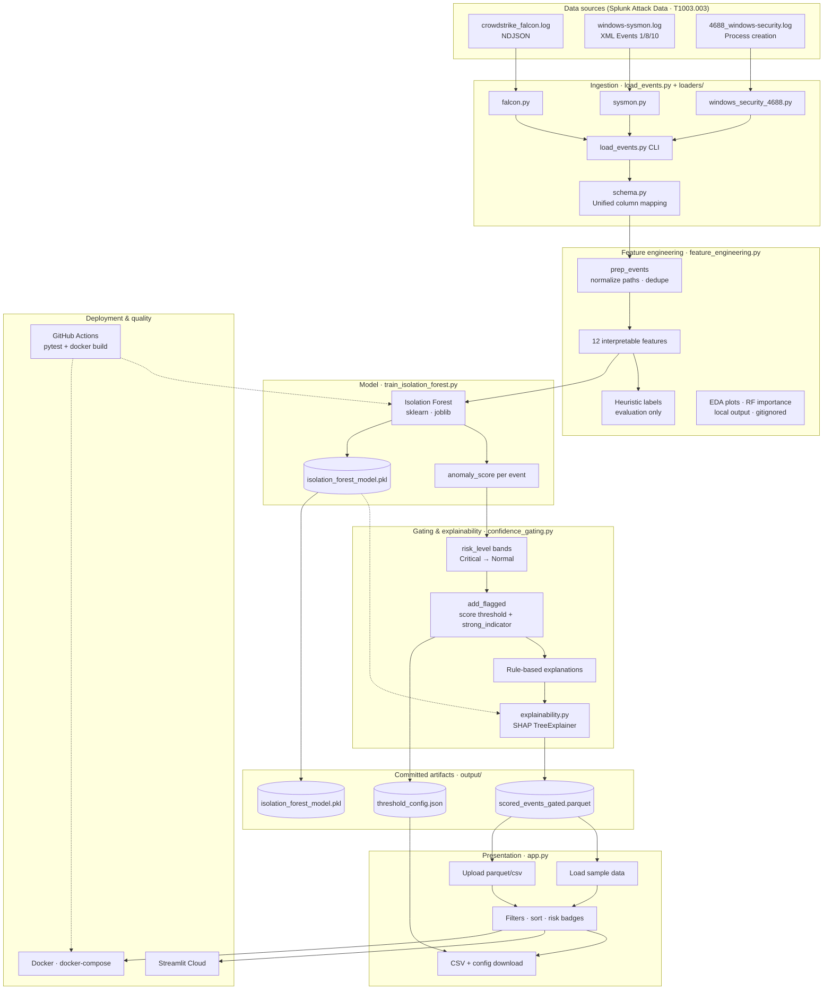
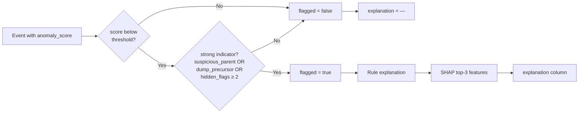

# Architecture & System Design

Full system design for **Breach Precursor Detector** (v1.1.0). The [README](../README.md) includes a compact overview diagram; this document is the detailed reference for contributors, code reviewers, and technical onboarding.

---

## Goals

| Goal | Approach |
|------|----------|
| Detect breach precursors without labeled attack training data | Unsupervised Isolation Forest on interpretable process features |
| Reduce alert fatigue | Confidence gating: flag only when anomaly score **and** domain indicator align |
| Keep analysts in the loop | Hybrid explanations: rule-based SOC strings + SHAP top-feature attribution |
| Reproducible demos | Committed parquet artifacts, threshold JSON, Docker, CI |

---

## End-to-end system diagram



---

## Confidence gating logic



**Important distinction**

| Concept | Meaning | Sample data (366 events) |
|---------|---------|---------------------------|
| `risk_level` | Percentile band from anomaly score (Critical / High / Medium / Low / Normal) | 74 non-Normal |
| `flagged` | Confidence-gated alert (score + strong indicator) | **19 alerts** |
| Streamlit main table | Shows **`flagged == true`** when column present | 19 rows with full explanations |

---

## Twelve interpretable features

Engineered in [feature_engineering.py](../feature_engineering.py):

| Feature | Description |
|---------|-------------|
| `suspicious_parent` | Parent is cmd, powershell, wmic, rundll32, or regsvr32 |
| `unusual_chain` | Parent–child pair matches known bad chains (e.g. cmd → lsass) |
| `cmd_entropy` | Shannon entropy of command line |
| `dump_precursor` | Keywords: lsass, procdump, mimikatz, ntds, sekurlsa, vssadmin |
| `hidden_flags` | Count of obfuscation flags (-enc, -nop, hidden window, etc.) |
| `pid_depth` | Process tree depth estimate |
| `time_delta_parent` | Seconds since parent process start (when available) |
| `lolbin_ratio` | LOLBAS binary in process or parent |
| `event_type_access` | Sysmon access / injection event types |
| `has_target_lsass` | Target or image references lsass |
| `long_cmd` | Command line length above threshold |
| `rare_parent_child` | Rolling rarity of parent–child pair in corpus |

---

## Explainability pipeline

1. **Rule-based** ([confidence_gating.py](../confidence_gating.py) `_explanation_one_row`): domain patterns (vssadmin shadow copy, encoded PowerShell, lsass access, etc.) plus anomaly score.
2. **SHAP** ([explainability.py](../explainability.py)): `TreeExplainer` on the saved Isolation Forest; top 3 features appended as `| Top features: feat (value), ...` for **flagged rows only**, at **batch time** during `confidence_gating.py`.
3. **Runtime UI**: Streamlit reads precomputed `explanation` column — no SHAP compute on request.

---

## Repository modules

| Module | Role |
|--------|------|
| [load_events.py](../load_events.py) | Orchestrates loaders; writes unified events |
| [loaders/](../loaders/) | Format-specific parsers → unified schema |
| [feature_engineering.py](../feature_engineering.py) | Prep, features, labels, EDA |
| [train_isolation_forest.py](../train_isolation_forest.py) | Train, score, save model |
| [confidence_gating.py](../confidence_gating.py) | Risk bands, gating, rules, SHAP wiring, config JSON |
| [explainability.py](../explainability.py) | SHAP attribution helpers |
| [app.py](../app.py) | Streamlit triage UI |
| [tests/](../tests/) | 90 offline unit + integration tests |
| [.github/workflows/tests.yml](../.github/workflows/tests.yml) | CI: pytest matrix + Docker build |

---

## Deployment topologies

### Local development

```text
pip install -r requirements.txt
streamlit run app.py          # sample parquet in output/
pytest tests/ -q              # requirements-dev.txt
```

### Docker

```text
docker compose up --build     # app on :8501, sample data baked in
docker compose --profile pipeline run --rm pipeline   # full batch pipeline
```

### Streamlit Cloud

- Connects to GitHub `main`; deploys `app.py` + `requirements.txt`.
- Sample data from committed `output/scored_events_gated.parquet`.
- Independent of GitHub Actions (CI validates; Cloud deploys on merge).

---

## Security & safety (architecture-level)

- **Read-only triage** — no endpoint response, blocking, or exploitation.
- **Simulation data** — Splunk Attack Data (T1003.003), not live EDR.
- **No secrets** — CI and demo run without API keys.
- **Upload validation** — schema and type checks in `app.py` before display.

---

## Version

Document reflects **v1.1.0** (SHAP, Docker, CI Docker build). See [README → Version history](../README.md#version-history).
